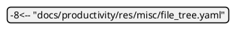
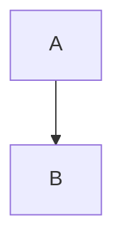
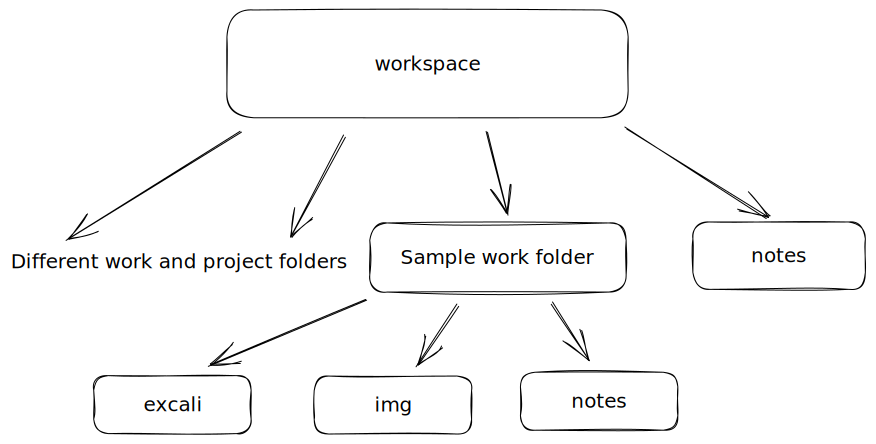

# Main

---
## Features
1.  A single source of docs which can be accessed on any browser.
    a.  Everything that you are learning and working on will be documented in one place
2.  Easily editable using vim which can run on all OS and platforms. 
3.  Ability to switch easily b/w different docs just like switching between different notes on the Notes Mac app
4.  The source docs should be easily convertible to different formats without any problems.
5.  Support for whiteboard drawings that can be added quickly to the md files.
6.  Support for mermaid and PlantUML diagrams
7.  Support for math equations

---

## Thought process

### General
I have notes on my Notes Mac app:
These notes will only be for notes that have to be edited on mobile as well OR for notes which are not important for learning.

To easily switch between different docs, I'll have to make something that can serve the directory structure.
This can be done using nginx OR
As mentioned in [[1]][ext1], mkdocs can also be used.
[[2]][ext2] gives a good overview of using md with vim. As per this document Marked 2 is a good app for integrating with vim on Mac.

### Feature 1
To get all the docs in one place I added symlinks of both `~/work` and `~/learn` directories to the mkdocs docs directory i.e `~/notes/docs`
To prevent all the source files and images from getting served when running `mkdocs serve` the files were excluded by adding a regex path in mkdocs exclude config in `mkdocs.yml`.

`'^(work|learn)\/(?!(.*\/docs\/|.*\.md$)).*'` - rejects all files except .md files and files in docs folder in work and learn"

The above works only if a consistent directory structure is used in work and learn directories.






### Feature 4 
For point 4 in [**Features**](#features)

The export to pdf will not allow me to use internal links to separate documents from one doc because one pdf cannot open another pdf.
There has to be a conversion mechanism so that I can use internal links to different docs in HTML but also use the same docs to create a single pdf that can reference internal links using heading attributes.

To solve this I have narrowed down my docs setup support to:

1.  Mkdocs HTML
2.  Pandocs HTML
3.  Pandocs PDF
    

Also, for reference you can look at:

1.  Marked 2 multidoc pdf conversion
2.  Readthedocs pdf conversion

### Feature 5

For simple and quick diagrams: Excalidraw
For detailed diagrams: Draw.io
It should be possible to draw without internet.

Excalidraw mostly requires internet but there is a plugin for vscode that enables offline use.
You can edit ".excalidraw.svg", ".excalidraw.png" and ".excalidraw" files using the plugin.
The ".excalidraw.svg" and ".excalidraw.png" files can be rendered in md files as well as edited using plugin, so I will be working with these files.
".excalidraw" files can be edited using plugin but not rendered in md files.

##### SVG or PNG

Check support for SVG and PNG in all docs that you want to support

Mac Screenshots are in PNG. This can be changed to any format.
import from iphone is jpeg.

Excalidraw vscode extension has an issue due to which existing `.excalidraw.svg` or '.excalidraw.png' files once edited and saved, the arrows lose the clipping around its text. Issue has been raised on Github.

SVG files have to be standalone when embedded in html due to security reasons. Refer [[4]][ext4].
The SVG files created by excalidraw import the font from the internet. The excalidraw font won't be rendered in HTML pages due to this.
A good guide on svg fonts [[5]][ext5]

In Pandoc MD to HTML conversion, SVG images require rsvg-convert tool to be installed.
To install this tool:
```
brew install librsvg
``` 

Will have to use PNG since font fetching from SVG is not allowed in browsers. So excalidraw svg diagrams will not work.
Other option is to embed font in SVG which would increase size of image. There is no such native option in excalidraw. Will have to write a script to replace the font URL by data uri of font automatically.
The file size of embedded font can be reduced by minifying the svg but this is getting too complex. Just go with PNG.

The 1x, 2x, 3x options in excali export can be used for getting higher resolution PNGs as checked.
Also the file size of PNGs seem to be very large compared to SVG. PFB.

-rw-r--r--@ 1 saurabhrajguru  staff    60K Mar 10 18:21 Virgil.woff2
-rw-------@ 1 saurabhrajguru  staff   228K Mar 10 18:07 orp_flow.excalidraw.png
-rw-------@ 1 saurabhrajguru  staff    30K Mar 10 20:16 orp_flow.excalidraw.svg
-rw-r--r--@ 1 saurabhrajguru  staff   583K Mar 10 18:04 orp_flow@2x.excalidraw.png

To use the small sizes I will try using inline SVG.
Inline SVG allows using css attributes and importing assets as they become part of the HTML and are not in image tags.
Install mkdocs-inline-svg plugin.
This plugin replaces the svg reference in the markdown file with the SVG file's content.
It doesn't work if the SVG has newlines as it puts a `<br/>` in place of newlines which breaks the rendering of the SVG image.
To sove this run the below command on the svg file to remove newlines.
```sh
tr -d '\n' < file.excalidraw.svg > temp && mv temp file.excalidraw.svg
```

Two font assets are referenced in ecalidraw generated SVGs: Virgil and Cascadia.
Only Virgil is being used in the SVG as I have checked.
To use it without internet, you need to replace the reference in the svg file from internet URL to local font file.
Downloaded the Virgil font file from [Virgil][ext7]. 
Saved it in the `diagrams/excalidraw/` folder of particular note directory.
Commented the internet font request and put the local font file as the reference. 

Another method to load the font is to use css instead of referencing the font in each excalidraw svg image.
Also, the inline svg does not fit into the rendered html. (Maybe it does - it is working after commenting `excalidraw.css` import in mkdocs.yml)
Have added `excalidraw.css` in `docs/css_mkdocs` folder for the above two points.

As you can see this is a manual process, you can edit the inline-svg plugin to remove the newlines and adding the local font reference while reading the .excalidraw.svg file without editing the excalidraw generated SVG in the file system. Source code is at: [mkdocs-inline-ext-svg][ext8].

Have resolved the manual process:
### Issue 2

Issue resolved by using `superfences` extension in mkdocs. Superfences changes the html format of code blocks due to which language syntax highlighting starts failing with highlight.js that is used by default in mkdocs.
To resolve this `highlight` extension has been added which use an extra css file generated by pygments to highlight the html generated by `superfences`.
To do this the css file is generated for html pages using the below command:

```sh
pygmentize -S default -f html > pygments.css
```

pygments.css is placed in docs/ directory of mkdocs and this is referenced in mkdocs.yml as below:

```yaml
extra_css:
  - css_mkdocs/pygments.css
```

### Feature 6

Refer [mermaid mkdocs plugin github site][ext10]
Have downloaded the mermaid js script and added it to `docs/js_mkdocs` directory so that I can work with it locally
It worked with 8.13.10 version. It doesn't work after that: >= 8.14.0 
Also copied the default config from <https://github.com/facelessuser/pymdown-extensions/blob/main/docs/src/js/material-extra-3rdparty.js>
Since I am using superfences I used a custom loader used in test/superfences/docs in [mermaid mkdocs plugin site][ext10]. This loader is copied from pymdownx extension site as mentioned in the docs.

```sh
curl https://unpkg.com/mermaid@8.13.10/dist/mermaid.min.js -o docs/js_mkdocs/mermaid@8.13.10.min.js
```

This is referenced in mkdocs.yml as below

```yaml
extra_javascript:
  - js_mkdocs/mermaid_config.js
  - js_mkdocs/mermaid@8.13.10.min.js
  - js_mkdocs/mermaid_loader.js
```

There is a problem with mermaid that doesn't allow individual nodes in subgraphs to be connected to other subgraph nodes with the flow of graph intact. 
Refer [[6]][ext6]

Comparision between Mermaid and PlantUML:
Diagrams created for ORP Prod architecture using mermaid and PlantUML to compare their features:
[mermaid](res/misc/orp_prod.mermaid)
[PlantUML](res/misc/orp_prod.puml)

Have installed `mkdocs_puml` plugin for PlantUML which uses online PlantUML server to render diagrams. Refer [`mkdocs_puml`][ext11]
You can self host PlantUML on docker and point it to that to enable offline work.


### A note on Diagramming tools

I did extensive reading on multiple diagramming tools, namely:

1.  excalidraw
    This tool is more like a rough whiteboard for initial design or collaborating on ideas.

    This does not support mermaid-js or PlantUML.

    Conclusion:
    I won't be using it in the note taking process as I believe I can draw faster using mermaid or PlantUML while taking notes. Also, drawio can be used for proper diagrams.
    Will use it for explaining to people (to write while drawing) or collab.
    
2.  diagrams.net (drawio)
    Mermaid flowcharts can be added as code and individual components are rendered automatically.
    PlantUML flowcharts can be added but they get added as a single shape. 
    This can draw big beautiful diagrams with explicit control on placement.
    Since drawio uses default fonts. I can just directly use the SVG generated by drawio without making them inline.

    Not so editable once created. You'll have to keep changing arrow lengths.
    drawio.svg can be edited in place but you will not able to understand the diffs in version control systems since it is an svg file.

    Conclusion:
    I will use this only if the diagram is finalised or if the diagram is very important.
    
3.  mermaid-js
    As mermaid flowcharts can be added directly to drawio, it will also help with final diagram if required.
    It is supported by Github and various other platforms.
    Better for working with Web side since it is loaded as a JS file.

    Lesser control on layout and control on components.
    Version control can be implemented where diffs can be visualised. (Since it is just text!)

    Conclusion:
    Will use this for quick diagrams during note taking. 

4.  PlantUML
    Has more control on layout and component formatting than mermaid.
    Also it offers a lot more features than mermaid.
    Version control can be implemented where diffs can be visualised. (Since it is just text!)

    It is not supported by Github and other platforms.
    Gets added as a single shape in drawio.
    Requires java and GraphViz installation OR server running PlantUML in a container to work locally.

    Conclusion:
    Use it for quick technical diagrams while note taking. Good for implementing software modelling frameworks like UML and C4

I also did extensive reading on Modelling frameworks

1.  UML
    Broadly divided into: structure diagrams (static aspects) and behaviour diagrams (dynamic aspects)
    PlantUML supports some
    Mermaid supports fewer

2.  [C4][ext9]
    Broadly categorises modelling process into the below heirarchy:
    System Context, Components, Container, Code

    PlantUML supports some C4 diagrams.

### Feature 7

Arithmatex: Preserves math in markdown for later processing (Refer [[12]][ext12])
Mathjax: Processes the Latex math to math output (Refer [[13]][ext13])
Added mathjax config, polyfill scripts and mathjax@3.2.2 folder to `docs/js_mkdocs/` folder. Same will be referenced in mkdocs.yml.
The whole folder had to be added for mathjax because the main script references other files from the cdn (eg. fonts)
Downloaded the es5 folder from <https://github.com/mathjax/MathJax>

```bash
curl -o docs/js_mkdocs/polyfill.min.js "https://polyfill.io/v3/polyfill.min.js?features=es6&flags=always"
```

$\operatorname{ker} f=\{g\in G:f(g)=e_{H}\}{\mbox{.}}$

---

## Folder structure


---

## Tools

Refer [productivity/tools][int1] for tools that I am using for documentation

---

## Issues

### Open
1.  The syntax highlighting in vim for image alt text is not working when `code` element has to be put in the alt text.
2.  Highlight.js is not allowing pygments.css to do the highlighting. For now I have disabled it.
3.  Indented fenced code blocks are not getting syntax highlighted in md files by VIM
4.  Puml plugin throws an uncaught error when writing the below content sometimes (ignore the brackets - I put it stop the actual rendering). This interrupts mkdocs.
      ```(puml)
      @startuml
      @enduml
      ```
5.  As observed puml svgs are getting affected by the `excali.css` file. They are rendered to fit the page.
    mermaid svgs are not getting affected by the css so they are overflowing the page boundary if diagram is big.
    Could be because mermaid is getting loaded after loading of page.
6.  Table headers are not getting aligned.
7.  Blank spaces are automatically removed when converting from md to html. So any manual alignment done with spaces is lost.
8.  Notes are not compatible with Github markdown rendering:
    * Stop using hard line breaks in your notes. With this you can even adhere to 80 character limit for lines.
    * do not use two spaces at the end for line break as they are not easily seen.
    * use bullets if you want new lines.
    * Will have to re format all the docs till now.

### Closed
1.  Indented fenced code blocks are not supported by mkdocs. This is possible in Github [[3]](ext3) and pandoc (checked myself)

## Roadmap

1.  The Horizontal rule while converting to PDF. The line is not from margin to margin. (Issue)
2.  Adding coloring support to text (Feature)
3.  Supporting Github Markdown rendering (Github pages) (Feature)
4.  The Reference links are getting right aligned due to word wrap when converting from md to pdf (Issue)
5.  Single source of docs should be updated irrespective of device (NAS/Cloud) (Feature)
6.  Mermaid support in fenced code blocks
7.  Indented fenced code blocks in PDFs using pandoc to be checked.

---

## References

[1] <https://medium.com/@TKalippke/all-you-have-to-do-is-type-yourself-494a2c0b2fd6>
[2] <https://vim.works/2019/03/16/using-markdown-in-vim/>
[3] <https://stackoverflow.com/questions/6235995/markdown-github-syntax-highlighting-of-code-block-as-a-child-of-a-list#:~:text=Just%20wrap%20your%20code%20blocks,t%20need%20to%20be%20indented.>
[4] <https://stackoverflow.com/questions/29494271/svg-fonts-are-not-loading-on-a-webpage-using-font-face-in-chrome>
[5] <https://css-tricks.com/using-custom-fonts-with-svg-in-an-image-tag/>
[6] <https://github.com/mermaid-js/mermaid/issues/2509> (mermaid;issue)
[7] <https://unpkg.com/@excalidraw/excalidraw@0.14.1/dist/excalidraw-assets/Virgil.woff2> (excalidraw;asset)
[8] <https://gitlab.com/nicolas.dupont/mkdocs-plugin-inline-svg> (mkdocs;inline-svg)
[9] <https://c4model.com/> (diagramming;c4;software;modelling)
[10] <https://github.com/fralau/mkdocs-mermaid2-plugin#basic-configuration> (mermaid;mkdocs;plugin)
[11] <https://github.com/MikhailKravets/mkdocs_puml> (mkdocs;puml;plugin)
[12] <https://facelessuser.github.io/pymdown-extensions/extensions/arithmatex/> (mkdocs;math)
[13] <https://squidfunk.github.io/mkdocs-material/reference/mathjax/> (mkdocs;math)

[int1]: tools.md#terminal

[ext1]: https://medium.com/@TKalippke/all-you-have-to-do-is-type-yourself-494a2c0b2fd6 
[ext2]: https://vim.works/2019/03/16/using-markdown-in-vim/
[ext3]: https://stackoverflow.com/questions/6235995/markdown-github-syntax-highlighting-of-code-block-as-a-child-of-a-list#:~:text=Just%20wrap%20your%20code%20blocks,t%20need%20to%20be%20indented.
[ext4]: https://stackoverflow.com/questions/29494271/svg-fonts-are-not-loading-on-a-webpage-using-font-face-in-chrome
[ext5]: https://css-tricks.com/using-custom-fonts-with-svg-in-an-image-tag/
[ext6]: https://github.com/mermaid-js/mermaid/issues/2509 (mermaid;issue)
[ext7]: https://unpkg.com/@excalidraw/excalidraw@0.14.1/dist/excalidraw-assets/Virgil.woff2 (excalidraw;asset)
[ext8]: https://gitlab.com/nicolas.dupont/mkdocs-plugin-inline-svg (mkdocs;inline-svg)
[ext9]: https://c4model.com/ (diagramming;c4;software;modelling)
[ext10]: https://github.com/fralau/mkdocs-mermaid2-plugin#basic-configuration (mermaid;mkdocs;plugin)
[ext11]: https://github.com/MikhailKravets/mkdocs_puml (mkdocs;puml;plugin)
[ext12]: https://facelessuser.github.io/pymdown-extensions/extensions/arithmatex/ (mkdocs;math)
[ext13]: https://squidfunk.github.io/mkdocs-material/reference/mathjax/ (mkdocs;math)
